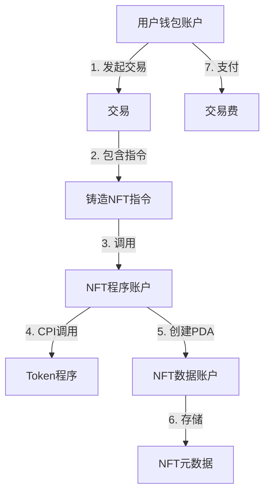

<!--more-->

## 🎯 前言

这篇文章用大白话帮你理解 Solana 的核心概念。如果你觉得原文太抽象，看这篇就对了！

---

## 1. 账户（Account）- 就像银行账户+存储盒

### 🏦 用一句话理解
**Solana 的账户 = 一个带地址的数据容器**，可以存钱（SOL）、存数据、或存程序代码。

### 🌰 生活化类比
想象 Solana 是一个巨大的银行：
- **账户地址** = 你的银行账号（32字节的唯一ID）
- **lamports** = 账户里的钱（1 SOL = 10亿 lamports，就像1元 = 100分）
- **data** = 账户里存的其他东西（比如你的会员信息、游戏道具等）
- **owner** = 这个账户由哪个"程序"管理（就像你的账户由哪家银行管理）

### 📦 账户的三大类型

#### 1. **系统账户（钱包）**
- **用途**：普通用户的钱包
- **类比**：你的银行储蓄卡
- **能做什么**：存 SOL、转账、支付交易费

#### 2. **程序账户（代码）**
- **用途**：存放智能合约代码
- **类比**：ATM 机器本身（里面有运行程序）
- **能做什么**：执行业务逻辑（比如转账、铸造NFT等）

#### 3. **数据账户（存储）**
- **用途**：程序用来存数据
- **类比**：银行的数据库（存你的交易记录、余额等）
- **能做什么**：保存程序的状态（比如你的NFT属性、游戏分数等）

### 🔑 关键点
- Solana 把"程序代码"和"程序数据"**分开存**（就像操作系统把 .exe 文件和数据库文件分开）
- 每个账户最大 **10MB**
- 所有账户都是**公开可查**的（区块链特性）

---

## 2. 指令（Instruction）- 就像填表单

### 🏦 用一句话理解
**指令 = 一张填好的表单**，告诉程序"我要做什么事"。

### 🌰 生活化类比
去银行办业务：
- **指令** = 一张"转账申请表"
  - **program_id** = 这张表要交给哪个柜台（哪个程序处理）
  - **accounts** = 涉及哪些账户（转出账户、收款账户）
  - **data** = 具体参数（转多少钱、备注信息等）

### 📝 举例：转 1 SOL 给朋友
```
指令内容：
- program_id: System Program（系统转账程序）
- accounts: 
  * 我的钱包（可写+需签名）
  * 朋友的钱包（可写）
- data: 转账金额 = 1 SOL
```

### 🔑 关键点
- 一个指令 = 一个操作（转账、铸造NFT、兑换代币等）
- **accounts 里要标明每个账户的权限**：
  - `is_signer`: 这个账户需要签名吗？（防止别人冒用你的钱包）
  - `is_writable`: 这个账户的数据会被改吗？（比如余额会减少）

---

## 3. 交易（Transaction）- 就像一个信封

### 🏦 用一句话理解
**交易 = 一个装了若干张表单（指令）的信封**，一次性提交给区块链处理。

### 🌰 生活化类比
去政府办事大厅：
- **交易** = 一个大信封
- **指令** = 里面装的各种表单（比如"转账申请"+"水电费缴纳"+"税务登记"）
- **签名** = 你在信封上盖章（证明是你本人提交的）

### 🎯 交易的三大特点

#### 1. **原子性**（要么全成功，要么全失败）
```
比如你要：
1. 把 A 代币换成 B 代币
2. 把 B 代币转给朋友

如果第2步失败，第1步会自动撤销（不会出现"换了币但没转出去"的情况）
```

#### 2. **按顺序执行**
```
交易里有 3 条指令：
指令1 → 指令2 → 指令3（严格按顺序）
```

#### 3. **有时间限制**
- 每个交易都绑定一个"最近的区块哈希"（相当于时间戳）
- 超过 **150 个区块**（约1分钟）就过期了

### 🔑 关键点
- 交易最大 **1232 字节**（太大会被拒绝）
- 第一个签名的人要支付**交易费**（5000 lamports/签名 ≈ 0.0003 美元）
- 交易费的 50% 会被**销毁**，50% 给验证者

---

## 4. 交易费 - 就像快递费+加急费

### 🏦 用一句话理解
**交易费 = 基础费（必须）+ 小费（可选）**

### 💰 费用构成

#### 1. **基础费（Base Fee）**
- **价格**：5000 lamports / 签名（约 0.0003 美元）
- **用途**：补偿验证者的计算成本
- **分配**：
  - 50% 销毁（减少 SOL 供应，类似通缩）
  - 50% 给验证者

#### 2. **优先费（Priority Fee）**
- **价格**：你自己定（可以是 0）
- **用途**：给验证者小费，让他优先处理你的交易
- **类比**：高峰期打车加价

### 🚀 什么时候需要付小费？
- 网络拥堵时（比如热门NFT开售）
- 你急着成交（比如抢购限量版）
- 否则可以设置为 0（不急的话）

### 🔑 关键点
- **计算单元（CU）**：类似"油费"，执行复杂操作需要更多 CU
- 优先费 = CU 价格 × CU 限制
- **建议**：模拟交易后，在估算的 CU 基础上加 10% 安全余量

---

## 5. 程序（Program）- 就像 App

### 🏦 用一句话理解
**程序 = Solana 上的智能合约/App**，代码存在链上，任何人都能调用。

### 🌰 生活化类比
- **以太坊** 叫它"智能合约"
- **Solana** 叫它"程序"
- 本质都是**链上的代码**

### 🛠 程序的特点
- **无状态**：程序本身不存数据（数据存在"数据账户"里）
- **公开可调用**：任何人都能通过发送交易来调用
- **可组合**：一个程序可以调用另一个程序（CPI）

### 📝 举例：Uniswap 类的交易程序
```
程序功能：把 A 代币换成 B 代币

程序账户：存放交换逻辑的代码
数据账户：存放流动性池的余额
用户调用：发送一条"兑换"指令
```

### 🔑 关键点
- 大部分程序用 **Rust** 写
- **Anchor 框架** = Solana 版的 React（简化开发）
- 程序可以**升级**（如果部署时设置了升级权限）

---

## 6. 程序派生地址（PDA）- 就像虚拟账户

### 🏦 用一句话理解
**PDA = 程序自动生成的"没有私钥"的地址**，用来存程序的数据。

### 🌰 生活化类比
普通账户 = 你的银行卡（你有密码）
PDA = 支付宝的"余额宝账户"（你看得见，但支付宝程序管理，你没有独立的密码）

### 🎯 为什么需要 PDA？
1. **不用记地址**：根据"种子"自动生成（比如"用户ID + 游戏ID"）
2. **程序能签名**：程序可以代替 PDA 签名（你不用每次都手动授权）
3. **方便管理**：就像哈希表，输入 key 就能找到对应的账户

### 📝 举例：NFT 质押程序
```
你质押 NFT 后，程序生成一个 PDA：
种子 = ["vault", 你的钱包地址, NFT的ID]

这个 PDA 地址：
- 存放你的 NFT
- 程序可以代替它签名（取出 NFT 时）
- 你随时能根据种子重新找到这个地址
```

### 🔑 关键点
- PDA **不在 Ed25519 曲线上**（所以没有私钥）
- **Bump seed**：一个额外的字节（0-255），用来微调地址使其有效
- **派生不等于创建**：找到地址后，还需要程序显式创建账户

---

## 7. 跨程序调用（CPI）- 就像程序间的协作

### 🏦 用一句话理解
**CPI = 程序 A 调用程序 B 的功能**，就像微信调用支付宝付款。

### 🌰 生活化类比
你在美团点外卖：
1. **美团程序** 接收你的订单指令
2. 美团**调用支付宝程序**扣款（这就是 CPI）
3. 支付宝**调用银行程序**转账（又是一次 CPI）

### 🎯 CPI 的两大作用

#### 1. **权限传递**
```
你授权程序 A（可签名+可写）
  ↓
程序 A 调用程序 B（CPI）
  ↓
程序 B 也能用这些权限（自动继承）
```

#### 2. **代码复用**
```
Token 程序：专门管理代币转账
交易程序：调用 Token 程序来转账（不用自己写转账逻辑）
```

### 🔑 关键点
- CPI 最多 **4 层**（总堆栈深度是 5，减去初始交易的 1 层）
- 权限会**自动传递**（但不能越权）
- PDA 可以在 CPI 中签名（虽然它没有私钥）

---

## 8. 总结：把所有概念串起来

### 🎬 完整流程示例：铸造一个 NFT



**详细步骤**：
1. 你的**钱包账户**（系统账户）发起一笔**交易**
2. 交易里包含一条**指令**："铸造NFT"
3. 指令调用**NFT程序账户**（程序账户）
4. NFT程序**CPI 调用** Token程序（创建代币）
5. NFT程序创建一个**PDA**（数据账户）存放 NFT 元数据
6. 你支付**交易费**（5000 lamports）
7. 整个过程**原子性执行**（要么全成功，要么全回滚）

---

## 9. 常见问题 FAQ

### Q1: Solana 和以太坊最大的区别是什么？
**A**: 
- **以太坊**：程序和数据存在一起（智能合约有自己的 storage）
- **Solana**：程序和数据分开（程序只有代码，数据存在独立的账户）

### Q2: 为什么 Solana 这么快？
**A**: 
1. **并行处理**：因为每个指令都标明了要用哪些账户，不冲突的指令可以同时执行
2. **无需竞价**：交易费固定，不像以太坊 gas 费暴涨
3. **高性能硬件**：验证者需要高配置服务器

### Q3: 交易失败会退费吗？
**A**: **不会**！即使交易失败，基础费也会被扣（验证者已经花费计算资源了）。所以发送前最好先**模拟交易**。

### Q4: 我怎么知道要付多少小费（优先费）？
**A**: 
1. 先模拟交易，看看需要多少 CU
2. 查看当前网络的 CU 价格（用 RPC 或工具查询）
3. 不急的话可以设为 0，急的话设置 10-100 micro-lamports/CU

### Q5: PDA 和普通账户有什么区别？
**A**:
| 特性 | 普通账户 | PDA |
|------|---------|-----|
| 有私钥 | ✅ 有 | ❌ 没有 |
| 能自己签名 | ✅ 可以 | ❌ 需要程序代签 |
| 地址生成 | 随机 | 确定性（根据种子） |
| 谁能操作 | 私钥持有者 | 创建它的程序 |

---

## 10. 学习建议 📚

### 🎯 学习路径
1. **先动手**：用 Solana CLI 创建钱包、转账（体验账户和交易）
2. **读代码**：看几个简单的 Anchor 程序示例
3. **写 Demo**：跟着教程写一个 "Hello World" 程序
4. **研究项目**：分析真实项目的代码（比如 Metaplex 的 NFT 程序）

### 🛠 推荐工具
- **Solana Playground**：在线写 Solana 程序（不用本地环境）
- **Solscan / Solana Explorer**：查看交易和账户
- **Anchor**：最流行的 Solana 开发框架

### 📖 进阶主题
- **Rent**：账户需要支付"租金"来保持活跃（或一次性存够最低余额）
- **Sealevel**：Solana 的并行运行时
- **Tower BFT**：Solana 的共识机制

---

## ✨ 最后的话

Solana 的设计哲学是**"账户模型 + 并行处理"**，这让它比以太坊快很多，但也带来了学习曲线。不要着急，慢慢消化这些概念，多写代码多实践，你会发现 Solana 其实挺优雅的！

**记住这个公式**：
```
交易 = 签名 + 消息（指令列表）
指令 = 程序ID + 账户列表 + 数据
程序 = 代码（存在程序账户）+ 状态（存在数据账户/PDA）
```

加油！🚀

